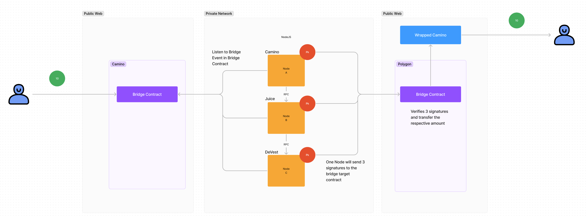

# Devest Bridge Documentation
## Overview
The Devest Bridge is a cross-chain token transfer protocol inspired by the Layer Zero approach. It leverages a multi-signature (multisig) mechanism where validator nodes collect and submit signatures to validate transactions. Unlike traditional methods, individual validator nodes do not submit separate transactions. Instead, one node gathers signatures from all validators and submits a single transaction to the smart contract. If at least half of the signatures are valid, the transaction is executed on the destination chain.

## Bridging workflow
This documentation outlines the process of initiating and completing a cross-chain token transfer between two blockchain networks using smart contracts and validators.

### Process Flow

#### 1. Transfer Initialization on Source Chain

1. **User Request:**
   - The process begins when a user initiates a transfer request on the source blockchain network.
   - The user specifies the amount of tokens to be transferred.

2. **Token Locking:**
   - The specified amount of tokens is locked in a smart contract on the source chain.
   - An event is fired by the smart contract to indicate the tokens have been locked.

#### 2. Event Detection by Validators

1. **Listening for Events:**
   - Validators are configured to monitor smart contracts on both the source and destination blockchain networks.
   - When a validator detects a token lock event on the source chain, it initiates the next step.

#### 3. Signature Collection

1. **Initiation by Validator:**
   - Upon detecting the TransferInitiated event, a validator begins the process of collecting signatures from other validators.
   - Validators validate the event and prepare their signatures.

2. **Consensus Mechanism:**
   - Validators use a consensus mechanism to approve the transfer.
   - A signature is collected from each validator.

#### 4. Completing the Transfer on Destination Chain

1. **Random Validator Selection:**
   - Once all necessary signatures are collected, a validator is randomly chosen to complete the transfer.

2. **Calling Transfer Function:**
   - The chosen validator calls the complete transfer function on the destination chain’s smart contract.

3. **Signature Verification:**
   - The smart contract checks if at least half of the signatures are correct and approved.

4. **Token Transfer:**
   - If the signature verification is successful, the equivalent amount of tokens locked on the source chain is transferred to the user from the smart contract on the destination chain.

**NOTE**:
Bridging tokens works only for predefined pairs, meaning the tokens need to be transferred and locked when setting up the bridge contracts. For example, Camino tokens on the Camino network can be transferred only to wrapped Camino tokens on the Polygon network. The smart contract on the destination chain needs to have a balance of wrapped Camino tokens that can be transferred to the user who initiates the bridging process.

The pairs can be set up by any validator address. This useful feature for strict pair bridging allows for tracking what tokens can be bridged and setting the maximum allowed amount a person can transfer. Setting a maximum allowed amount of tokens that can be bridged with a single transaction is a safety mechanism that prevents attackers from pulling the whole balance of the bridge.

### Smart Contract Events and Functions

#### Source Chain Smart Contract

- **Events:**
  - `TransferInitiated(address sender, address recipient, uint256 amount, uint256 source_chain, uint256 destination_chain, address token_in, address token_out)`: Fired when tokens are locked by the user
  - `FundsRecovered(address recipient, uint256 amount, uint256 source_chain, uint256 destination_chain, address token_in, string nonce, bytes[] signatures)`: Fired when tokens are returned to the recipient

- **Functions:**
  - `initiateTransfer(address recipient, uint256 amount, uint256 source_chain, uint256 destination_chain, address token_in, address token_out)`: Locks the specified amount of tokens and fires the `TokensLocked` event.
   - `recoverFunds(address recipient, uint256 amount, uint256 source_chain, uint256 destination_chain, address token_in, string memory nonce, bytes[] memory signatures)`: Returns tokens to the recipient on the source chain in case of transfer failure on the destination chain

#### Destination Chain Smart Contract

- **Events:**
- `TransferCompleted(address recipient, uint256 amount, uint256 source_chain, uint256 destination_chain, address token_in, address token_out, string nonce, bytes[] signatures, address msg_sender)`: Fired when tokens are transfered to the user on the destination chain.
- `TransferBlocked(uint256 source_chain, uint256 destination_chain, string nonce, bytes[] signatures)`: Fired when transfer is blocked on the destination chain.

- **Functions:**
  - `completeTransfer(address recipient, uint256 amount, uint256 source_chain, uint256 destination_chain, address token_in, address token_out, string memory nonce, bytes[] memory signatures)`: Verifies the signatures and transfers tokens to the user if the signatures are valid.
  - `blockTransfer(uint256 source_chain, uint256 destination_chain, string memory nonce, bytes[] memory signatures)`: Blocks the transfer so that tokens can be safly returned on the source chain.

## Smart Contracts Overview

### DvBridge
The primary contract that manages cross-chain transfers, validator operations, and integrates functionalities from TokenController, TransferManager, and ValidatorSignatureManager.

#### Key Variables
- **locked**: A boolean indicating whether the bridge is currently locked for transfers to addresses other than validators.
- **chain_id**: The ID of the chain where the contract is deployed.
- **validator_fee**: The fee to be paid to validators for each transaction.

#### Key Functions
- **constructor**: Initializes the contract with chain ID, validator fee, and validators.
- **initiateTransfer**: Initiates a transfer by locking tokens in the contract.
- **completeTransfer**: Completes a transfer by sending tokens to the recipient.
- **setLockedState**: Locks or unlocks the bridge for transfers to non-validators.
- **voteValidator**: Handles validator voting for adding or removing validators.
- **setAllowedTransfer**: Sets allowed transfer parameters for a specific destination chain and token.
- **setValidatorReward**: Sets the validator reward fee.
- **recoverFunds**: Recovers funds to a recipient address in case of a failed transfer.
- **blockTransfer**: Blocks a transfer in case the funds need to be returned on the recipient on the source chain.

#### Additional Details
- **Events**:
  - `TransferInitiated`: Emitted when a transfer is initiated.
  - `TransferCompleted`: Emitted when a transfer is completed and tokens are transfered to recipient on destination chain.
  - `TransferBlocked`: Emitted when a transfer is blocked.
  - `FundsRecovered`: Emitted when funds are recovered, providing details like recipient, amount, source chain, destination chain, token, nonce, and signatures.
  - `BridgeLocked`: Emitted when the bridge lock status is changed.

- **Mappings**:
  - `validatorFeeVotes`: Tracks votes related to validator fees.
  - `lockVotes`: Tracks votes related to locking the bridge.

### ValidatorSignatureManager
The `ValidatorSignatureManager` contract handles signature verification with a set of validators, ensuring that cross-chain transfers and other operations are securely validated by multiple trusted parties.

#### Key Variables
- **validators**: An array of addresses representing the validators.
- **validatorVotes**: A mapping to track votes from validators.

#### Key Functions
- **constructor**: Initializes the contract with a list of validators.
- **getTransactionMessage**: Generates a message hash of transaction details, used for validation.
- **getRecoverFundsMessage**: Generates a message hash for fund recovery, used for validation.
- **getBlockTransferMessage**: Generates a message hash for blocking transfers.
- **getVoteValidatorMessage**: Generates a message hash for validator voting.
- **getVoteRewardMessage**: Generates a message hash for voting on rewards.
- **getAllowedTransferMessage**: Generates a message hash for setting allowed transfers.
- **getLockMessage**: Generates a message hash for locking operations.
- **verifySignature**: Verifies that a given signature matches the expected signer for a provided message hash.
- **verifySignatures**: Verifies if the provided signatures are valid and from validators.
- **isValidator**: Checks if a given address is a valid validator.

### TransferManager
The `TransferManager` contract extends the `TokenController` contract and manages allowed transfers between token pairs on different chains.

#### Key Variables
- **allowedTransferVotes**: A mapping to track votes related to allowed transfers.
- **allowed_transfers**: A nested mapping to manage allowed transfers between token pairs on different chains.
- **transfers**: A mapping to track transfer records.

#### Key Functions
- **constructor**: Initializes the contract.
- **__setAllowedTransfer**: Sets allowed transfer details for a destination chain and token pair.
- **isTransferAllowed**: Checks if a transfer is allowed for a given destination chain and token pair.
- **recordTransfer**: Records a transfer to prevent duplicates.

#### Additional Details
- **Structs**:
  - **DestinationToken**: Contains details about a token pair's transfer status, including the output token address, active status, and maximum allowed amount.

## Private Network

### Validator Nodes

Validator nodes play a critical role in bridging networks, validating transactions, and maintaining network integrity. They listen to smart contract events and interact with other nodes via a private network to manage and validate transactions.

#### Key Features
- **Network Bridging:** Responsible for bridging to other networks and rewarded for validation efforts.
- **Preconfiguration:** Nodes need to be preconfigured before joining the network.
- **Peer Communication:** Use `express` to establish communication with other nodes.
- **Event Listening:** 
  - Nodes listen to chain events every 10 seconds.
  - They check for `TransferInitiated`, `TransferCompleted`, `TransferBlocked` events.
- **Transaction Management:** 
  - On finding a new transfer initiated event, the main node collects signatures from all other validators and submits the transaction once all signatures are collected.
- **Executor node election**
  - When transfer is completed on the destination chain, next node responsible for collecting the signatures and compliting transaction is selected at random.
- **Unauthorized Transfer Detection:** 
  - Nodes can detect unauthorized transfers and lock the bridge contracts if necessary.
  - Locking the bridge allows for additional time to investigate the issue.
  - Once the bridge is locked, funds in the contract can only be transferred only to a validator address.
- **Notifications and Voting:**
  - Utilizes Telegraph to notify if contracts are locked.
  - Facilitates voting for adding/removing allowed tokens, adding/removing validators and setting validator rewards.
- **Security:** Each node has its own private key, which must be protected.

#### Workflow
1. **Startup:**
   - Nodes need to be provided with the private key of the public address set in the smart contracts.
2. **Peer Network Connection:**
   - Nodes communicate with each other with `express` library.
3. **Event Listening:**
   - Listens to chain events every 10 seconds.
4. **Transaction Initiation:**
   - If an `TransferInitiated` event is detected, the main node contacts other validators to collect signatures.
   - Once all signatures are collected, the transaction is submitted.
5. **Unauthorized Transfer Handling:**
   - If an unauthorized transfer is detected, nodes can lock the bridge contracts.
6. **Notifications and Voting:**
   - Uses Telegraph/GUI for notifications and supports voting for network governance.

#### Security Considerations
- **Private Key Protection:** Emphasizes the importance of protecting each node's private key to maintain network security.
- **Chain Event Monitoring:** Regularly listens to chain events to detect and handle unauthorized transfers.
